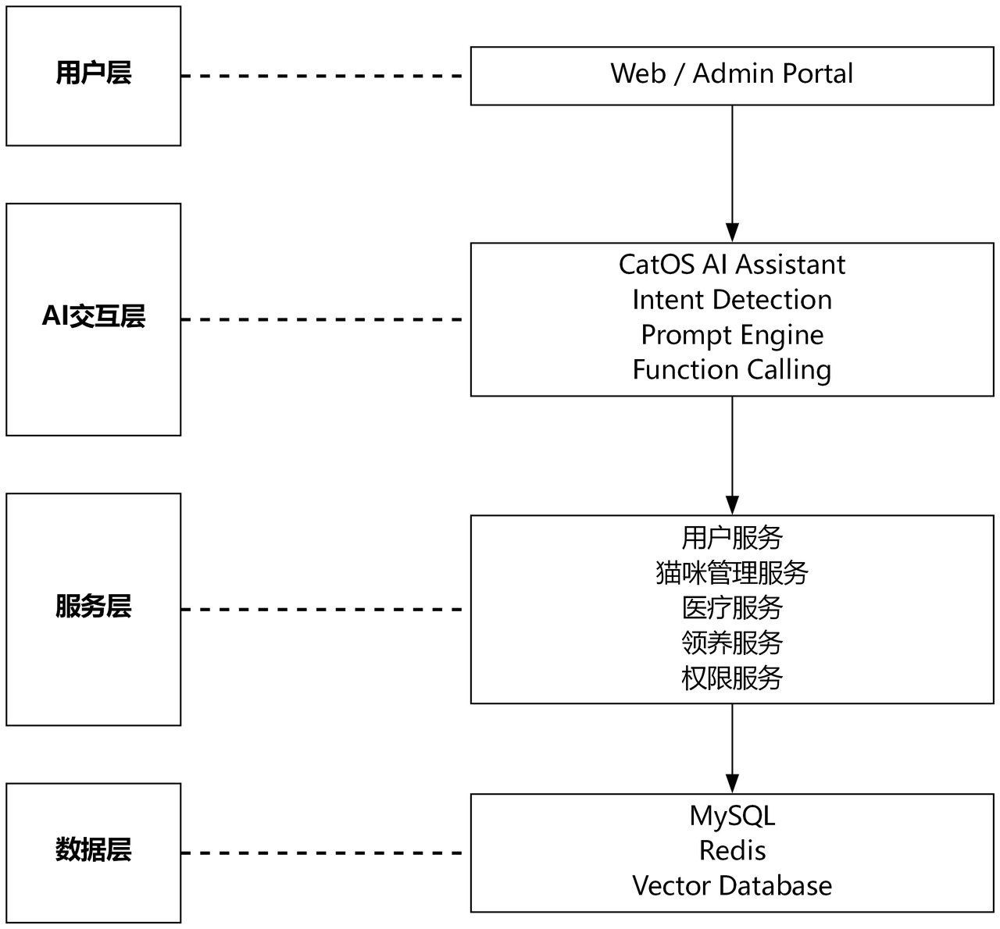

# Campus-Cat-AI-Management-System

随着宠物经济快速发展，宠物医院、动物救助机构以及个人养宠用户对于宠物数字化管理需求不断提升。传统宠物管理系统仅支持基础信息录入、列表查询与人工维护，存在三大核心痛点：

■ **信息管理效率低**：宠物信息分散存储在Excel表格、纸质医疗记录、微信聊天记录中，工作人员需要手动整理猫咪基础档案、诊疗记录、领养登记、疫苗接种信息，人工成本极高。

■ **业务查询成本高**：传统系统需手动进入页面、配置筛选条件、导出数据后人工统计分析，工作量繁重。典型场景：统计7天内需接种疫苗猫咪、筛选健康异常个体、统计月度领养总量等。

■ **专业知识获取困难**：普通校园养猫志愿者面对猫咪食欲下降、反常行为、喂养调整、疾病预防等问题，缺少一站式专业咨询渠道。

随着大语言模型（LLM）技术成熟，AI可实现以下能力：
- 自然语言理解
- 自动化数据分析
- 宠物养护智能问答
- 业务任务自动执行

基于以上背景，本项目 **Campus-Cat-AI-Management-System** 应运而生：一款融合AI Agent能力的校园流浪猫数字化管理平台。

## 系统架构

<!-- width 控制图片大小，800/700/600 数字越小图越小 -->

 
<em>图：CampusCatVision 系统整体架构</em>

